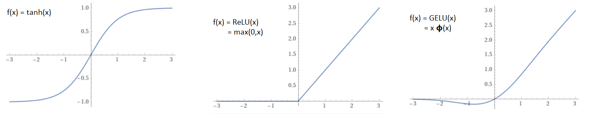
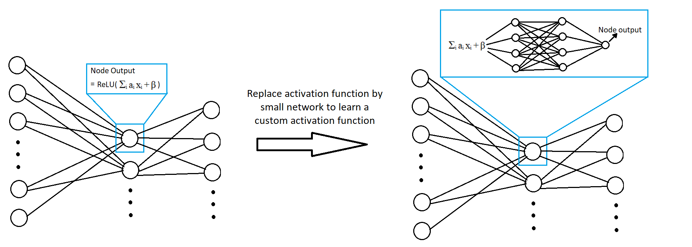
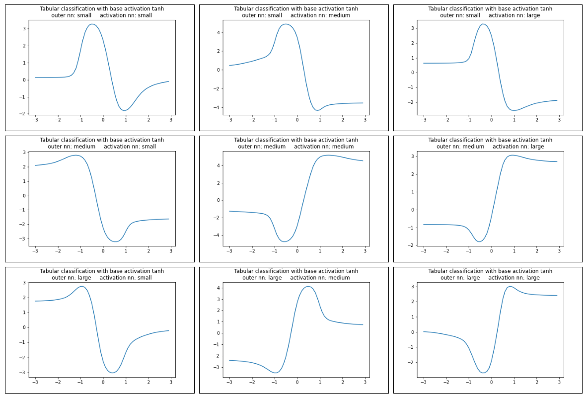
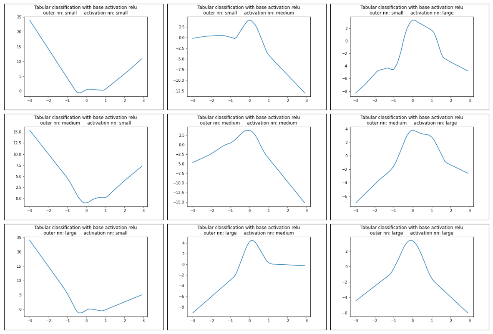
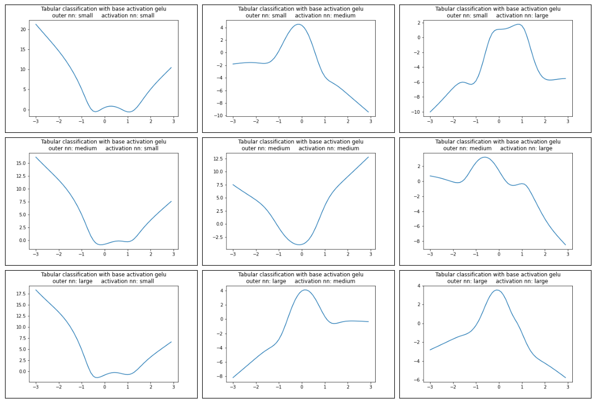

# Introduction

When working with neural networks one of the design choices to make is the activation function to use. In recent years many different functions have been proposed for usage as non-linearities in neural networks reflecting different heuristics on what an activation function should look like.In this project we want to outsource the question of what an activation function should look like to the neural network itself, we will have it learn its own activation function completely from scratch and see what the resulting functions graph looks like. 

Note that this project is merely for fun. We will not talk about the performance in detail and we will not test the method on different datasets either. The list of only three known activation functions (namely Tanh, ReLU and GELU) we will show and graphically compare to the neural networks own choice of a function is far from complete. For a comprehensive comparison of a more complete list of activation functions please refer to papers like [1]. Also note that the activation functions we will create are not meant to be used in practice (see the closing words of this readme). 

# Replacing the activation function 

Activation functions are non-linear, univariate, one-dimensional functions. Typical examples are the Tanh, ReLU and GELU function, shown below. 

Historically the Tanh - as well as the sigmoid function - was one of the first functions used in neural networks. It is a natural choice because it is monotonic, returns values between -1 and 1 (hence keeping the data within limits) and represents a continous seperation of the data into two categories.   
The ReLU (Rectified Linear Unit) is the most commonly used activation function in neural networks today. In comparison to the Tanh it has the big advantage of not suffering from the dying gradient problem, that is for values far away from 0 the Tanh gradient is very close to zero. Used within deep neural networks this hampers learning quite a bit. At the same time ReLU allows for very fast calculation both in forward and backward pass. 
While the ReLU solves the dying gradient problem, it leads to a different issue: The dying neuron problem. Due to the part of the ReLU function that sets all negative inputs to zero, a pattern can arise where some of the neurons of the network always output zero for all of the inputs and thus do not contribute at all. Many new activation functions have been introduced that tackle this problem. One of the is the GELU (Gaussian Error Linear Unit) function. Motivated by a stochastic argument (see [2] for details) the function looks very similar to a ReLU function but sacrifices monotony in order to not zero out the entire negative part. 

Of course there are a lot more intricacies at play with the different activation functions. However, as we just want to have a bit of fun with the graphs of these functions a basic description shall be enough for our purposes. The interested reader is encouraged to check out the cited papers for more details. 


<figure>
    
     <p style='text-align: center'>
      <figurecaption>Figure 1: Graphs of the discussed activation functions. From left to right: Tanh, ReLU, GELU. 𝞍 denotes the standard normal cumulative distribution function. Graphs plotted with WolframAlpha. </figurecaption>
    </p>
</figure>

The three functions introduced are prominent examples of functions that have been tested by researchers and proved to do well. Now let's see what a neural network comes up with when allowed to 'choose' (that is learn via training) its own activation function. To do so, we will replace the non-linearities within our network with a smaller network. That is after calculating the linear combinantion of all inputs into a node instead of applying a pre determined non-linear function we let the linear combination run through a separate smaller network. This smaller network will be the same for all nodes in the network. On top of that in order to actually work as a replacement for an usual activation function the smaller network must only take one single input as well as having a singular output as well. Figure 2 illustrates the replacement. Of course the smaller network needs its own non-linearities to produce a meaningful activation function, hence we will still be making use of the tried and trusted usual activation functions within the smaller network. However once fully trained we can compare the smaller network to said activation functions and interpret the usage of the smaller network as a replacement of the activation function with some other function described by the network. 

<figure>
    
     <p style='text-align: center'>
      <figurecaption>Figure 2: For this project we replace the usual activation functions (here ReLU) by a small univariate one-dimensional network that will be able to learn a custom activation function. The network that replaces the usual non-linearity is the same for all nodes of the outer network. </figurecaption>
    </p>
</figure>

The details on the implementation of this network structure can be found in the network_classes.py script.

# Custom trained activation functions

Let us now have a look what the custom activation functions learned by the smaller networks (we will also call them activation networks from here on) look like. To do so we will train our modified network on a basic tabular binary classification task - namely the covertype dataset (https://www.openml.org/search?type=data&status=active&id=44121), a binary version of a known dataset with the objective to classify a patch of soil according to the type of tree growing on it. Note that, apart from replacing the activation function, the network we use is a standard fully connected feed forward network. We train different versions of our network, varying the size of the activation network and the 'actual' outer network as well as the basic activation function used within the activation network. The sizes of the networks are classified as 'small', 'medium' and 'large' and the exact number of nodes used in each layer are listed in the table below (here the notation [48,24] means that the network has two layers with 48 nodes in the first layer and 24 in the second, not including the output layer). The basic activation functions we use are the three functions introduced earlier: Tanh, ReLU and GELU. In total there are 27 different combinations for our network setup.

|        | outer network | activation network |
|--------|---------------|--------------------|
| small  | [48,24]       | [16,8]             |
| medium | [48,24,16]    | [32,16]            |
| large  | [96,48,32]    | [32,16,8]          |


The code to run all 27 different combinations and train an according network on the dataset is found in custom_activation_tabular_classification.py. The script saves the activation functions (that is their pytorch state dictionaries) and the graph of these functions (as png file) in the folder nn_activation_functions. The code below loads the png-files and shows them as output so we can have a look at what the customly learned activation functions look like.


```python
import matplotlib.pyplot as plt
from PIL import Image
from mpl_toolkits.axes_grid1 import ImageGrid
import itertools

PROJECT_PATH = '...' # choose your project path here
IMG_PATH = PROJECT_PATH + 'nn_activation_functions/'         

l_outer_nn_size = ['small','medium','large']
l_activ_nn_size = ['small','medium','large']

```


```python
base_activ = 'tanh'

fig = plt.figure(figsize=(15., 15.))
grid = ImageGrid(fig, 111,  
             nrows_ncols=(3, 3),  
             axes_pad=0.1)

product_sizes = itertools.product(l_outer_nn_size, l_activ_nn_size)

print("Custom activation functions with ",base_activ," as base activation function:")

for i, (gr, (outer_size, activ_size)) in enumerate(zip(grid,product_sizes)):
    img = Image.open(IMG_PATH + 'tab_classification_covertype_' + base_activ + '_' + outer_size + '_' + activ_size +'.png')
    grid[i].get_yaxis().set_ticks([])
    grid[i].get_xaxis().set_ticks([])
    gr.imshow(img)
```

    Custom activation functions with  tanh  as base activation function:
    


    

    


```python
base_activ = 'relu'

fig = plt.figure(figsize=(15., 15.))
grid = ImageGrid(fig, 111,  
             nrows_ncols=(3, 3),  
             axes_pad=0.1)

product_sizes = itertools.product(l_outer_nn_size, l_activ_nn_size)

print("Custom activation functions with ",base_activ," as base activation function:")

for i, (gr, (outer_size, activ_size)) in enumerate(zip(grid,product_sizes)):
    img = Image.open(IMG_PATH + 'tab_classification_covertype_' + base_activ + '_' + outer_size + '_' + activ_size +'.png')
    grid[i].get_yaxis().set_ticks([])
    grid[i].get_xaxis().set_ticks([])
    gr.imshow(img)
```

    Custom activation functions with  relu  as base activation function:
    


    

    


```python
base_activ = 'gelu'

fig = plt.figure(figsize=(15., 15.))
grid = ImageGrid(fig, 111,  
             nrows_ncols=(3, 3),  
             axes_pad=0.1)

product_sizes = itertools.product(l_outer_nn_size, l_activ_nn_size)

print("Custom activation functions with ",base_activ," as base activation function:")

for i, (gr, (outer_size, activ_size)) in enumerate(zip(grid,product_sizes)):
    img = Image.open(IMG_PATH + 'tab_classification_covertype_' + base_activ + '_' + outer_size + '_' + activ_size +'.png')
    grid[i].get_yaxis().set_ticks([])
    grid[i].get_xaxis().set_ticks([])
    gr.imshow(img)
```

    Custom activation functions with  gelu  as base activation function:
    


    

    


# Discussion of the custom activation functions

We can see that the activation functions with tanh as their base activation are the most consistent, as they all look very similar to each other. Meanwhile the relu and in particular the gelu based functions seem to overfit to the problem when the outer network is not large enough. This becomes apparant by the presence of some smaller local maxima/minima. Such maxima/minima are very unlikely to work well in a general purpose activation function as they imply the mapping of several input values to the same output values. 

In all cases the base activation function becomes visible within the extrapolating part of the functions (that is at the edges), we can see the typical logistic-like convergence in the tanh-based graphs, the straight forward lines in the relu-based graphs and the slightly curved lines in the gelu-based graphs. 

More interesting than the differences might be the similarities of the functions. The first thing to note is that there is almost always a clear minimum (or maximum, which due to symmetry does not matter) close to x = 0 - this is particularly interesting as among the activation functions only the gelu function has an actual strict minimum. Moving away from this minimum it is easy to see that in almost all cases the function increases more rapidly than on one side than on the other (or in case of the tanh-based function the convergence limit is higher on one side), which presumably helps with distinguishing better between values left and right from the minimum. In some cases of the relu/gelu-based function the flatter part does not increase at all, but remains at a constant value, such that these functions actually resemble the gelu a little bit (that is one minimum in the middle, one side that flattens out and one side that increases linearly).

# Closing notes on generalisation

We did not report any performance metrics for the shown functions. This is because we wanted to focus on the graphs of the customly learned activation functions and not so much on the performance. Having said this we will note that the performance of the shown function on the chosen task is on par with the usual base activation functions. However, when trying some of the learned activation functions on a different task the performance did not hold up to the usual basic activation functions, which implies that the functions shown here are an overfit to the problem and will likely not generalize will to other deep learning datasets or tasks. To actually learn a new activation function that works with a broad range of problems and architecture one would probably have to learn the function on a wide range of different training tasks.   

# References

[1]: Dubey, Singh, Chauduri: 'Activation Functions in Deep Learning: A Comprehensive Survey and Benchmark', arXiv:2109.14545 [cs.LG], 2022
[2]: Hendrycks, Gimpel: 'Gaussian Error Linear Units (GELUs)',  arXiv:1606.08415 [cs.LG], 2016

